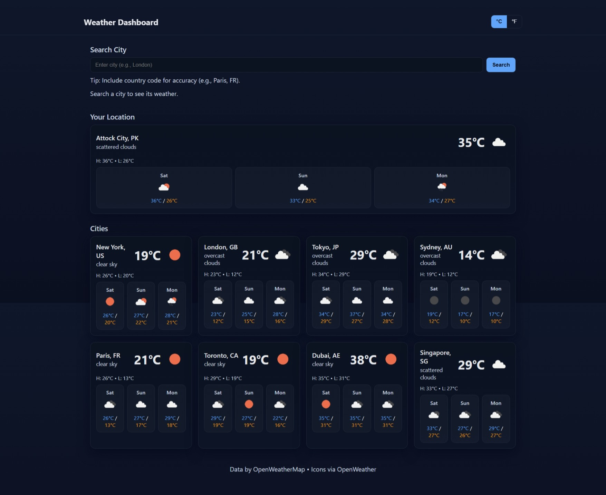
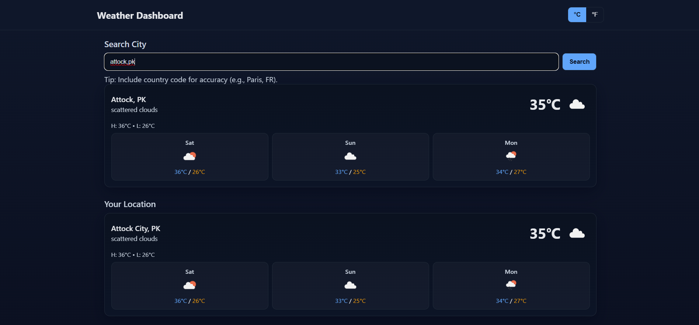

# Weather Dashboard  

A responsive weather dashboard built with **HTML, CSS, and JavaScript**, using a weather API to provide current conditions and forecasts for any city.  

## 🚀 Features  

- 🌍 **Search by City**: Enter a city to get current weather info  
- 🌡️ **Weather Data**: Displays temperature, humidity, wind speed, and description  
- ⏳ **Forecast**: Extended weather forecast for multiple days  
- 🎨 **Responsive Design**: Clean layout optimized for mobile and desktop  
- 🔑 **API Integration**: Fetches real-time data from a weather API (e.g., OpenWeatherMap)  

## 📸 Screenshots  

  
  

## 🛠️ Tech Stack  

- **Frontend**: HTML5, CSS3, JavaScript (ES6)  
- **API**: OpenWeatherMap API (or similar)  
- **Styling**: Custom CSS  

## 📋 Prerequisites  

- A modern browser (Chrome, Firefox, Edge)  
- A valid **Weather API Key** (from [OpenWeatherMap](https://openweathermap.org/api))  

## 🚀 Getting Started  

### 1. Clone the Repository  

```bash
git clone https://github.com/hooriaajmal/weather-dashboard.git
cd weather-dashboard
```

### 2. Add API Key  

In `config.js`, add your API key:  

```javascript
const API_KEY = "your_api_key_here";
```

### 3. Open the App  

Simply open `index.html` in your browser.  
No build steps are required.  

## 📁 Project Structure  

```
weather-dashboard/
├── index.html      # Main HTML page
├── styles.css      # Styles for dashboard
├── app.js          # Weather fetching & UI logic
├── config.js       # API key configuration
└── README.md       # Documentation
```

## 🎯 Features in Detail  

### Search Functionality  
- Enter any city in the search bar  
- Press enter or click search button  
- Fetches real-time data from the API  

### Weather Data  
- Temperature (°C/°F)  
- Humidity (%)  
- Wind speed (km/h or mph)  
- Weather condition (e.g., Clear, Cloudy, Rain)  

### Forecast  
- Displays multi-day forecast  
- Shows min/max temperatures  
- Weather icons for conditions  

### Responsive Design  
- Mobile-first layout  
- Works on desktop, tablet, and mobile  

## 🚀 Deployment  

### GitHub Pages  
1. Push your repo to GitHub  
2. Enable GitHub Pages in repo settings  
3. Your site will be available at:  
   ```
   https://hooriaajmal.github.io/weather-dashboard/
   ```  

### Netlify / Vercel  
- Drag and drop your project folder to [Netlify](https://netlify.com) or [Vercel](https://vercel.com) for instant deployment.  

## 🤝 Contributing  

1. Fork the repository  
2. Create a branch: `git checkout -b feature-name`  
3. Commit changes: `git commit -m 'Add feature'`  
4. Push branch: `git push origin feature-name`  
5. Open a Pull Request  

## 👤 Author  

**Your Name**  
- GitHub: (https://github.com/hooriaajmal)  
- Email: hooriaajmal9@gmail.com  

## 🙏 Acknowledgments  

- [OpenWeatherMap API](https://openweathermap.org/)  
- [MDN Docs](https://developer.mozilla.org/)  

---  

⭐ If you found this project helpful, please give it a star on GitHub!  
